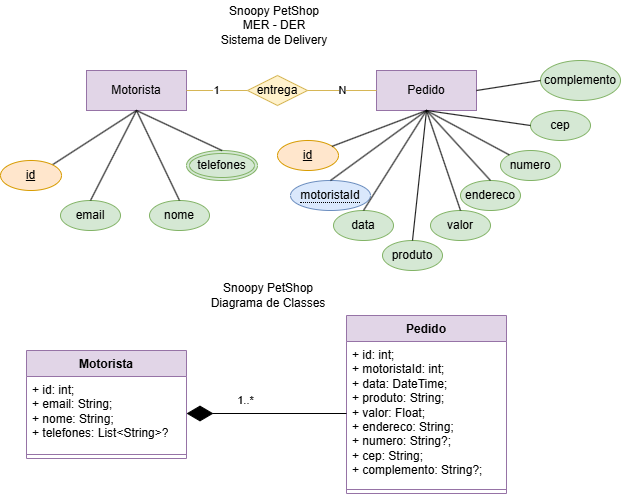

# SNOOPY PetShop Delivery API
Situação de Aprendizagem - Back-End (Node.JS, JavaSript, VsCode, ORM Prisma, Insomnia)
## Contextualização
SNOOPY PetShop tem atuado em nossa cidade com ótimo atendimento e agilidade, é nosso cliente e necessita de um sistema Web para registro das entregas ou serviços a domicílio, como busca de animais para banho, tosa e outros serviços. O P.O. após uma visita ao cliente elaborou o DER e UML DC(Diagrama de Classes) a seguir e elencou os requisitos funcionais. 

## Desafio
Desenvolver as funcionalidades conforme requisitos

### Requisitos funcionais
- [RF001] O sistema deve permitir o CRUD de Motoristas.
    - [RF001.1] Um motorista pode possuir mais de um telefone ou nenhum, desta forma o campo telefones deve ter espaço suficiente para cadastrar vários números (255 caracteres) e permitir nulo.
    - [RF001.2] A rota **readOne** do motorista deve mostrar os dados de um cliente específico e seus pedidos.
- [RF002] O sistema deve permitir o CRUD de pedidos.
    - [RF002.1] O sistema deve associar o pedido a um motorista.
    - [RF002.1] O Pedido deve na rota **read** deve somar o total dos **valores**.

### Casos de teste (Insomnia)
- [CT001] Deve ser cadastrado pelo menos 5 motoristas.
- [CT002] Deve ser cadastrado 1 telefone para cada motorista.
    - [CT002.1] Pelo menos 1 motorista não deve ter telefone cadastrado, ou seja **nulo**.
- [CT003] Cadastre, altere e exclua um motorista.
- [CT004] Cadastre um pedido para cada motorista.
    - [CT004.1] Pelo menos um motorista deve ter dois ou mais pedidos cadastrados.
- [CT005] Cadastre, altere e exclua um pedido.

## Tecnologias
- Node.JS

## Passo a Passo de como executar a API
